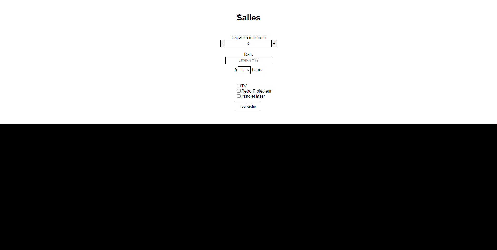
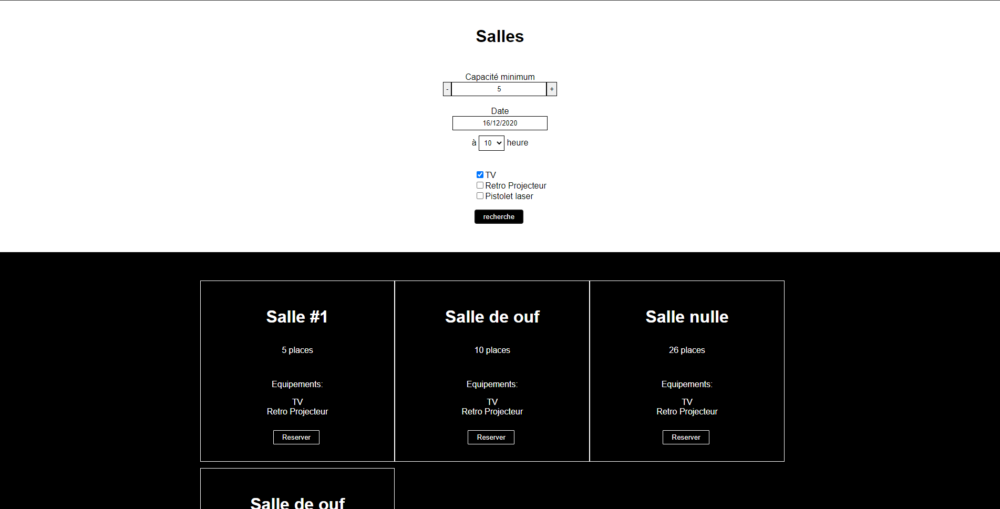
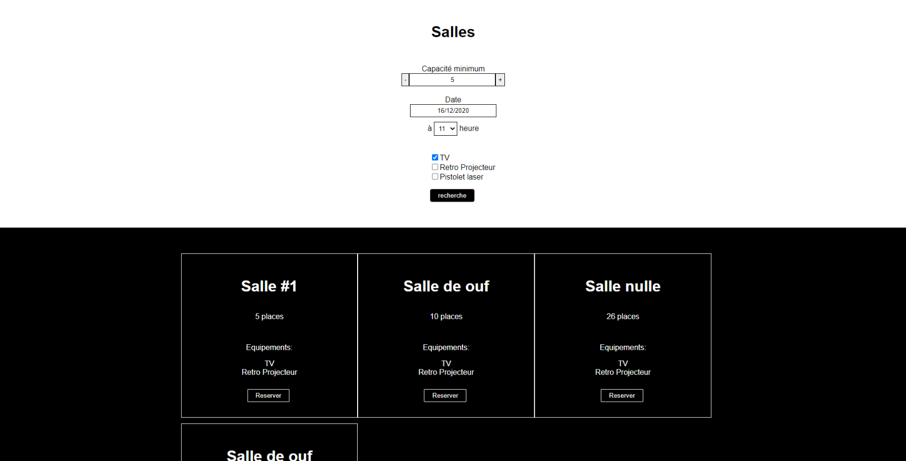
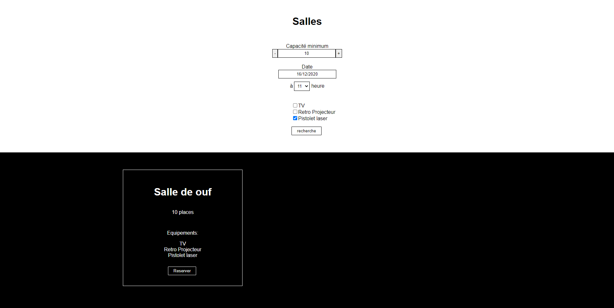
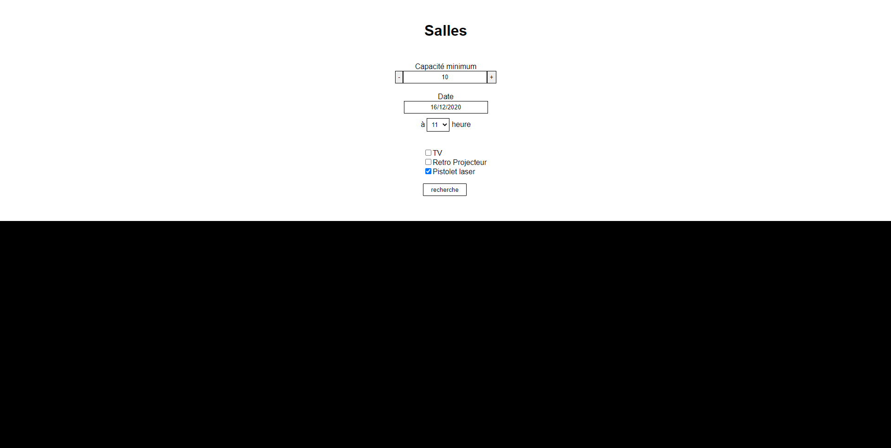
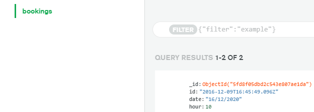

# StationFest
Voici StationFest,

Projet réalisé afin de tester mes compétences par [stationf](https://stationf.co/)
Celui ci affiche les différentes salles disponibles, selon différents filtres.

projet uniquement réalisé en VueJS / NodeJS / MongoDB (mongoose)

Voici donc la page de base, sans avoir rechercher, nous avons donc à notre disposition différents filtres

* Capacité minimum : Permet de spécifier une capacité minimum des salles.
* Date(et heure) : Permet de spécifier une heure et une date à laquelle on veut réserver notre salle.
* Enfin, les différents équipements disponible dans les salles qu'on peux cocher si l'un d'eux est nécessaire.

Après avoir recherché une salle pour le 16/12/2020 à 10 heure à une capacité minimum de 5 personnes avec une TV, 4 choix s'offre à moi, je choisi donc de reserver la "salle nulle".

Celle-ci disparait des résultats et ne réapparaitra pas pour la même date et heure.

Celle-ci est donc à nouveau disponible à 11h

Disons maintenant que je veux une nouvelle salle pour le 16/12/2020 à 11h, mais cette fois ci pour 10 personnes et avec un pistolet laser (si si, c'est toujours utile en salle de réunion !)

Un choix s'offre à moi, une salle de 10 places, avec une TV, un Retro Projecteur et un pistolet laser ! Je peux la reserver et il n'y aura plus de salle disponible avec un pistolet laser à cet horaire.

### Q&A

Q : Comment les salles sont définies ?

A : Dans le dossier node/controllers, il y a un fichier `rooms.json` ou se trouvent la liste des salles

Q : Comment les équipements sont définis ?

A : Dans la liste des salles, il y a la liste de leurs équipements, je récupère les différentes valeurs et les propose en filtre !

Q : Ce projet m'a l'air super ! Mais comment je le lance au juste?

A : Rien de plus simple,
- Dans le dossier node créez un fichier nommé `.env` et inscrivez-y votre uri atlas comme indiqué ci dessous avec comme dbname et collection "bookings"
    - `ATLAS_URI=<VOTRE_ATLAS_URI>`
- Dans le dossier node exécutez les commandes suivantes dans l'ordre
    - `npm install`
    - `npm start`
- Dans le dossier vue exécutez les commandes suivantes dans l'ordre
    - `npm install`
    - `npm run serve`

Q : Comment je stock les réservations ?

A : Avec MongoDB Atlas, je peux ainsi m'en servir pour différencier les salles réservées des disponibles

